# Azure Portal GUI Deployment Guide — Enterprise Infrastructure

Complete step-by-step walkthrough to deploy the entire enterprise Azure infrastructure using **only the Azure Portal GUI**. No CLI, no Bicep, no PowerShell — every resource created by clicking through the portal.

Covers all five AZ-104 exam domains at production depth.

---

## Table of Contents

- [Phase 0: Prerequisites](#phase-0-prerequisites)
- [Phase 1: Resource Groups](#phase-1-resource-groups)
- [Phase 2: Identity & Governance](#phase-2-identity--governance)
- [Phase 3: Networking](#phase-3-networking)
- [Phase 4: Storage](#phase-4-storage)
- [Phase 5: Security](#phase-5-security)
- [Phase 6: Compute](#phase-6-compute)
- [Phase 7: Monitoring](#phase-7-monitoring)

---

## Phase 0: Prerequisites

### Step 0.1 — Sign Up for Azure Free Trial

1. Go to `https://azure.microsoft.com/en-us/free/`
2. Click **Start free**
3. Sign in with a Microsoft account (or create one with a personal email)
4. Complete identity verification (phone + credit card — you will NOT be charged)
5. Click **Sign up** — you land on `https://portal.azure.com` with $200 credit

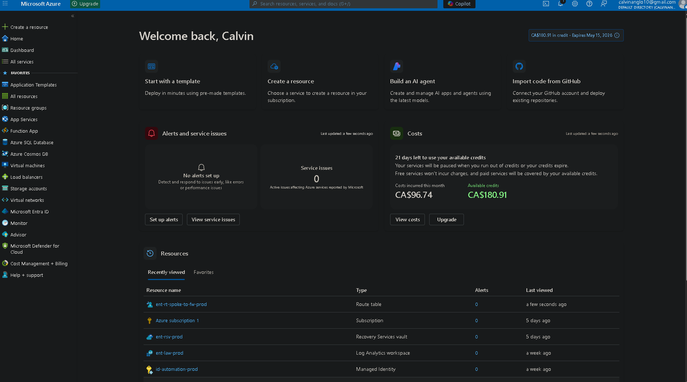

---

## Phase 1: Resource Groups

> **AZ-104 Domain**: Identity & Governance (15-20%)
> Resource groups are logical containers that hold related Azure resources. Every resource must belong to exactly one resource group. They provide lifecycle management, access control boundaries, and cost tracking.

### Step 1.1 — Create Resource Groups

Create 5 resource groups to organize resources by function. This follows the principle of least privilege — each group gets its own RBAC scope.

1. Portal Home → **Resource groups** → **Create**
2. Fill in:
   - **Subscription**: Azure subscription 1
   - **Resource group**: `ent-rg-networking-prod`
   - **Region**: East US 2
3. Click **Tags** tab:
   - `Environment` = `prod`
   - `ManagedBy` = `Bicep`
   - `Project` = `enterprise-infra`
   - `CostCenter` = `IT-OPS-001`
4. Click **Review + create** → **Create**

Repeat for these 4 additional resource groups (same region, same tags):

| Resource Group | Purpose |
|---|---|
| `ent-rg-compute-prod` | VMs, VMSS, Recovery Services |
| `ent-rg-storage-prod` | Storage accounts |
| `ent-rg-security-prod` | Key Vault, Managed Identities |
| `ent-rg-monitoring-prod` | Log Analytics, Alerts |

**Verify**: Go to **Resource groups** — all 5 should appear with "East US 2" location.

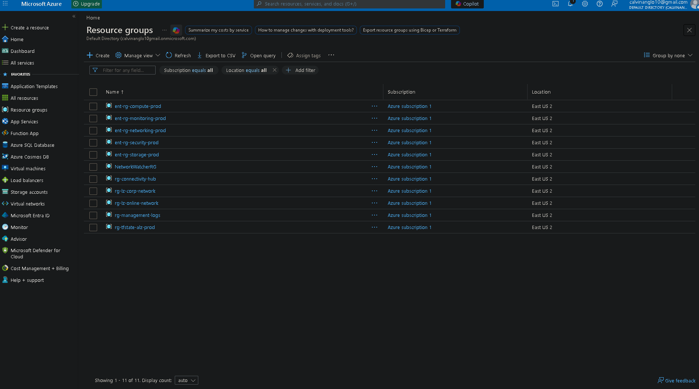

---

## Phase 2: Identity & Governance

> **AZ-104 Domain**: Identity & Governance (15-20%)
> Microsoft Entra ID (formerly Azure AD) manages identity. RBAC controls who can do what. Policies enforce organizational standards. Locks prevent accidental deletion.

### Step 2.1 — Create Entra ID Users

1. Portal → **Microsoft Entra ID** → **Users** → **New user** → **Create new user**
2. For each user below, fill in:
   - **User principal name**: (name)@(yourtenant).onmicrosoft.com
   - **Display name**: (full name)
   - **Job title**: (title)
   - **Department**: (department)
   - **Usage location**: United States
   - Check **Auto-generate password** and note the temporary password
3. Click **Create**

| Username | Display Name | Department | Job Title |
|---|---|---|---|
| `j.chen` | James Chen | IT | Sr. Infrastructure Admin |
| `m.rodriguez` | Maria Rodriguez | IT | Network Operations Lead |
| `a.patel` | Anya Patel | Security | Security Analyst |
| `s.kim` | Sarah Kim | Development | Lead Developer |
| `r.jackson` | Robert Jackson | Operations | VM Operations Specialist |
| `l.martinez` | Luis Martinez | Operations | Monitoring Engineer |
| `k.williams` | Karen Williams | Security | Compliance Officer |
| `t.nguyen` | Thomas Nguyen | Operations | Backup Administrator |
| `e.davis` | Emily Davis | Development | DevOps Engineer |
| `d.wilson` | David Wilson | Management | IT Director |

### Step 2.2 — Create Security Groups

1. **Microsoft Entra ID** → **Groups** → **New group**
2. Group type: **Security**
3. Create each group and add members:

| Group Name | Members |
|---|---|
| `sg-infra-admins-prod` | j.chen, m.rodriguez |
| `sg-network-ops-prod` | m.rodriguez |
| `sg-vm-operators-prod` | r.jackson |
| `sg-monitoring-readers-prod` | l.martinez |
| `sg-security-auditors-prod` | a.patel, k.williams |
| `sg-backup-operators-prod` | t.nguyen |

4. **Dynamic group** (requires Entra ID P1 — available in free trial):
   - **New group** → Group type: **Security** → Membership type: **Dynamic User**
   - Name: `sg-all-it-dynamic-prod`
   - Click **Add dynamic query** → Rule: `(user.department -eq "IT")`
   - **Validate Rules** → verify IT users appear → **Save**

### Step 2.3 — Create Custom RBAC Roles

1. Portal → **Subscriptions** → select your subscription → **Access control (IAM)**
2. **Roles** tab → **Add** → **Add custom role**
3. Click **Start from JSON** or **Start from scratch**

**Role 1: VM Operator (prod)**
- Name: `VM Operator (prod)`
- Description: Start, stop, restart VMs and VMSS — no create/delete
- Permissions → **Add permissions**:
  - `Microsoft.Compute/virtualMachines/read`
  - `Microsoft.Compute/virtualMachines/start/action`
  - `Microsoft.Compute/virtualMachines/restart/action`
  - `Microsoft.Compute/virtualMachines/deallocate/action`
  - `Microsoft.Compute/virtualMachines/powerOff/action`
  - `Microsoft.Compute/virtualMachineScaleSets/read`
  - `Microsoft.Compute/virtualMachineScaleSets/start/action`
  - `Microsoft.Compute/virtualMachineScaleSets/restart/action`
  - `Microsoft.Compute/virtualMachineScaleSets/deallocate/action`
- Assignable scopes: `/subscriptions/{your-sub-id}/resourceGroups/ent-rg-compute-prod`
- **Review + create**

**Role 2: Network Viewer (prod)**
- Name: `Network Viewer (prod)`
- Description: Read-only access to all networking resources
- Permissions: `Microsoft.Network/*/read`
- Assignable scopes: `/subscriptions/{your-sub-id}/resourceGroups/ent-rg-networking-prod`

**Role 3: Monitoring Reader Plus (prod)**
- Name: `Monitoring Reader Plus (prod)`
- Description: Read metrics, manage alerts, deny action group changes
- Permissions:
  - `Microsoft.Insights/metrics/read`
  - `Microsoft.Insights/alertRules/*`
  - `Microsoft.Insights/metricAlerts/*`
  - `Microsoft.OperationalInsights/workspaces/read`
  - `Microsoft.OperationalInsights/workspaces/query/read`
- Not Actions: `Microsoft.Insights/actionGroups/write`
- Assignable scopes: `/subscriptions/{your-sub-id}/resourceGroups/ent-rg-monitoring-prod`

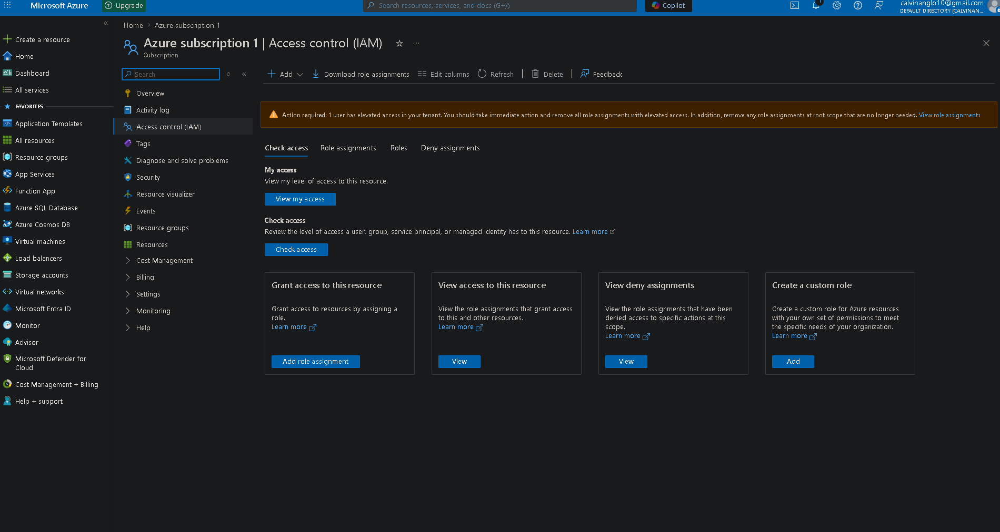

### Step 2.4 — Assign RBAC Roles to Groups

1. **Subscriptions** → your subscription → **Access control (IAM)** → **Add** → **Add role assignment**
2. For each assignment:
   - Select **Role** → search for the role name
   - Click **Members** tab → **Select members** → search for the group
   - **Review + assign**

| Group | Role | Scope |
|---|---|---|
| sg-infra-admins-prod | Contributor | Subscription |
| sg-vm-operators-prod | VM Operator (prod) | ent-rg-compute-prod |
| sg-network-ops-prod | Network Viewer (prod) | ent-rg-networking-prod |
| sg-monitoring-readers-prod | Monitoring Reader Plus (prod) | ent-rg-monitoring-prod |
| sg-security-auditors-prod | Reader | ent-rg-security-prod |
| sg-backup-operators-prod | Backup Contributor | ent-rg-compute-prod |

### Step 2.5 — Assign Azure Policies

1. Portal → **Policy** → **Assignments** → **Assign policy**
2. For each policy:
   - **Scope**: Select your subscription
   - **Policy definition**: Search for the built-in policy name
   - Fill in parameters
   - **Review + create**

| Policy Definition (built-in) | Effect | Parameters |
|---|---|---|
| Require a tag and its value on resources | Deny | Tag: `Environment`, Value: `prod` |
| Require a tag on resource groups | Deny | Tag: `CostCenter` |
| Allowed locations | Deny | `eastus2`, `centralus`, `westus2` |
| Network interfaces should not have public IPs | Deny | — |
| Secure transfer to storage accounts should be enabled | Audit | — |

**Test**: Try creating a resource group in North Europe — it should fail with "RequestDisallowedByPolicy".

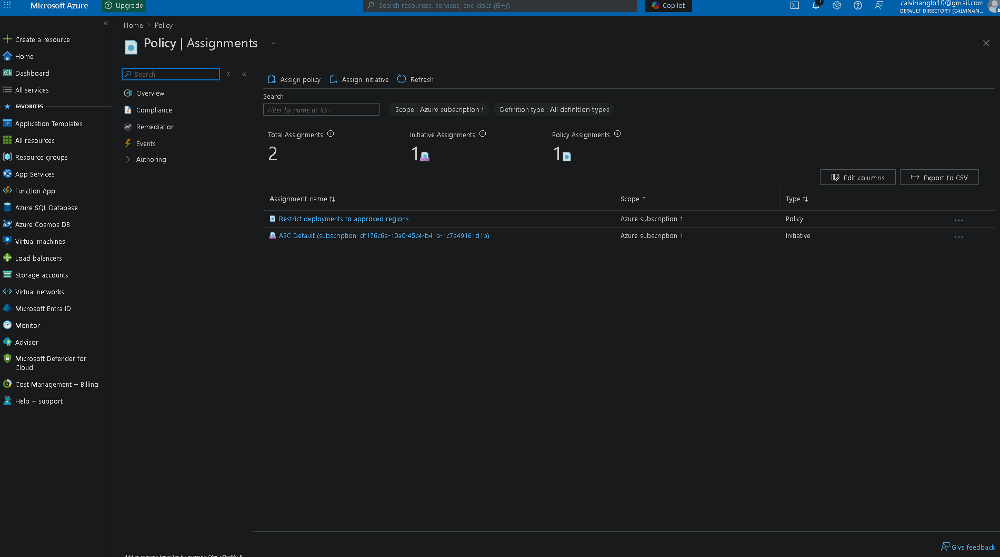

### Step 2.6 — Apply Resource Locks

1. Go to **ent-rg-networking-prod** → **Locks** (left menu) → **Add**
   - Name: `lock-networking-nodelete`
   - Lock type: **Delete**
   - Note: "Production networking — remove lock before deleting"
2. Go to **ent-rg-security-prod** → **Locks** → **Add**
   - Name: `lock-security-nodelete`
   - Lock type: **Delete**
3. Go to **ent-rg-monitoring-prod** → **Locks** → **Add**
   - Name: `lock-monitoring-readonly`
   - Lock type: **Read-only**

**Test**: Try deleting `ent-rg-networking-prod` — it should fail with "ScopeLocked".

---

## Phase 3: Networking

> **AZ-104 Domain**: Networking (25-30%)
> Hub-spoke topology routes all traffic through a central firewall. NSGs filter traffic at the subnet level. UDRs override Azure's default routing. Load balancers distribute traffic across backend pools. DNS provides name resolution.

### Step 3.1 — Create Hub Virtual Network

1. Portal → **Virtual networks** → **Create**
2. **Basics** tab:
   - Resource group: `ent-rg-networking-prod`
   - Name: `ent-vnet-hub-prod`
   - Region: East US 2
3. **IP Addresses** tab:
   - Address space: `10.0.0.0/16`
   - Delete the default subnet
   - **Add subnet**:

| Subnet Name | Address Range | Purpose |
|---|---|---|
| `AzureFirewallSubnet` | `10.0.1.0/26` | Required name for Azure Firewall |
| `AzureBastionSubnet` | `10.0.2.0/26` | Required name for Azure Bastion |
| `GatewaySubnet` | `10.0.3.0/27` | Required name for VPN/ExpressRoute Gateway |
| `snet-management` | `10.0.4.0/24` | Management jump boxes |

4. **Tags**: `Environment`=`prod`, `ManagedBy`=`Bicep`, `Project`=`enterprise-infra`, `CostCenter`=`IT-OPS-001`
5. **Review + create** → **Create**

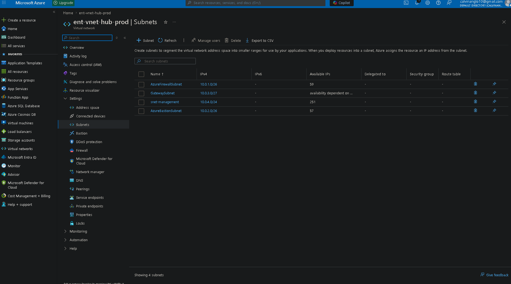

### Step 3.2 — Create Web Spoke Virtual Network

1. **Virtual networks** → **Create**
2. Resource group: `ent-rg-networking-prod`
3. Name: `ent-vnet-web-prod`
4. Region: East US 2
5. Address space: `10.1.0.0/16`
6. Add subnet:
   - Name: `snet-web`
   - Range: `10.1.1.0/24`
7. Tags (same as hub)
8. **Create**

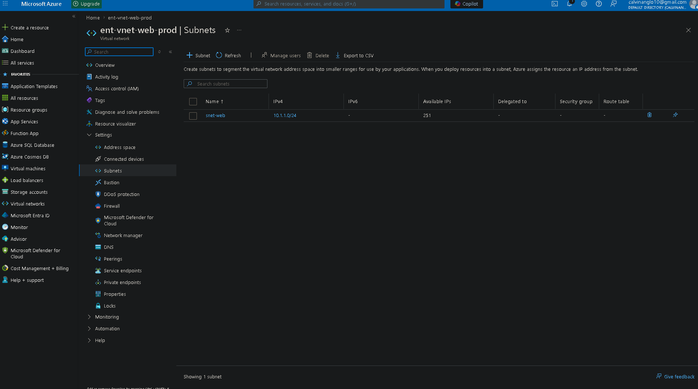

### Step 3.3 — Create App Spoke Virtual Network

1. **Virtual networks** → **Create**
2. Resource group: `ent-rg-networking-prod`
3. Name: `ent-vnet-app-prod`
4. Region: East US 2
5. Address space: `10.2.0.0/16`
6. Add subnet:
   - Name: `snet-app`
   - Range: `10.2.1.0/24`
7. Tags (same as hub)
8. **Create**

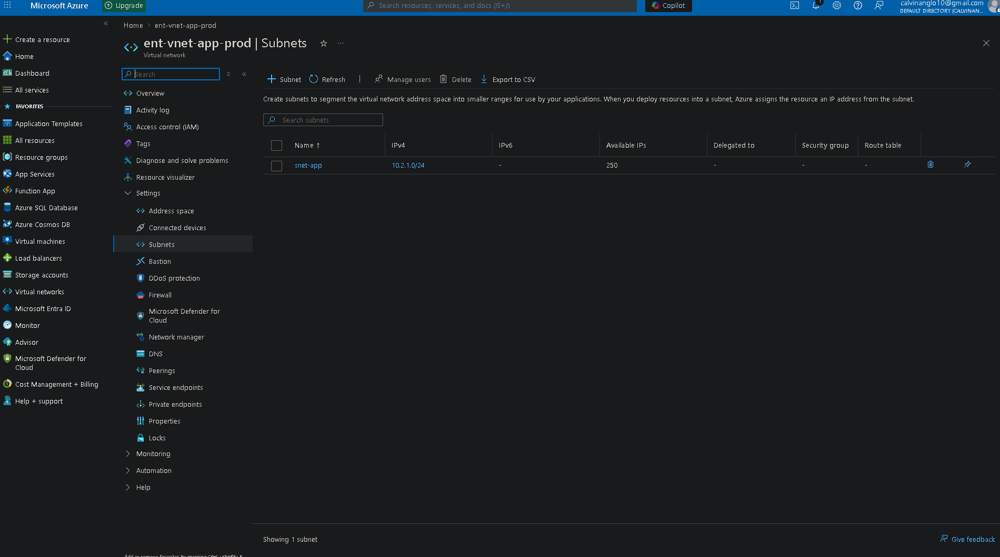

### Step 3.4 — Create VNet Peerings (Hub-Spoke)

Hub-to-Web peering:
1. Go to **ent-vnet-hub-prod** → **Peerings** → **Add**
2. This virtual network:
   - Peering link name: `peer-hub-to-web`
   - Allow traffic to remote VNet: **Enabled**
   - Allow forwarded traffic: **Enabled**
   - Allow gateway transit: **Enabled** (hub side only)
3. Remote virtual network:
   - Peering link name: `peer-web-to-hub`
   - Virtual network: `ent-vnet-web-prod`
   - Allow traffic to remote VNet: **Enabled**
   - Allow forwarded traffic: **Enabled**
   - Use remote gateway: **Disabled**
4. Click **Add**

Hub-to-App peering:
1. Go to **ent-vnet-hub-prod** → **Peerings** → **Add**
2. Repeat the same pattern:
   - This side: `peer-hub-to-app` (allow gateway transit)
   - Remote side: `peer-app-to-hub` on `ent-vnet-app-prod`
3. Click **Add**

**Verify**: Both peerings should show **Peering status: Connected** and **Fully Synchronized**.

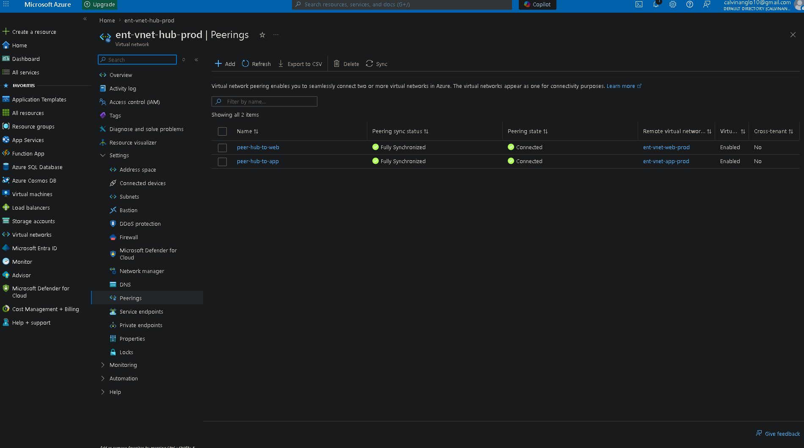

### Step 3.5 — Create Azure Firewall

1. Portal → **Firewalls** → **Create**
2. **Basics**:
   - Resource group: `ent-rg-networking-prod`
   - Name: `ent-fw-prod`
   - Region: East US 2
   - Firewall SKU: **Standard**
   - Firewall management: **Use a Firewall Policy to manage this firewall**
   - Firewall policy: **Add new** → name: `ent-fw-policy-prod`
   - Virtual network: `ent-vnet-hub-prod` (choose existing)
   - Public IP: **Add new** → name: `ent-fw-pip-prod`
3. **Tags** (same as before)
4. **Review + create** → **Create** (takes ~10 minutes)

After creation — add firewall rules:
1. Go to **ent-fw-policy-prod** → **Rule collections** → **Add a rule collection**
2. Name: `net-allow-dns-ntp`
3. Rule collection type: **Network**
4. Priority: `100`
5. Action: **Allow**
6. Add rules:

| Rule Name | Source | Destination | Port | Protocol |
|---|---|---|---|---|
| allow-dns | `10.0.0.0/8` | `*` | `53` | UDP |
| allow-ntp | `10.0.0.0/8` | `*` | `123` | UDP |
| allow-http-out | `10.0.0.0/8` | `*` | `80,443` | TCP |

7. Click **Add**

**Note the Firewall private IP** (found on the Firewall overview page) — you need this for route tables.

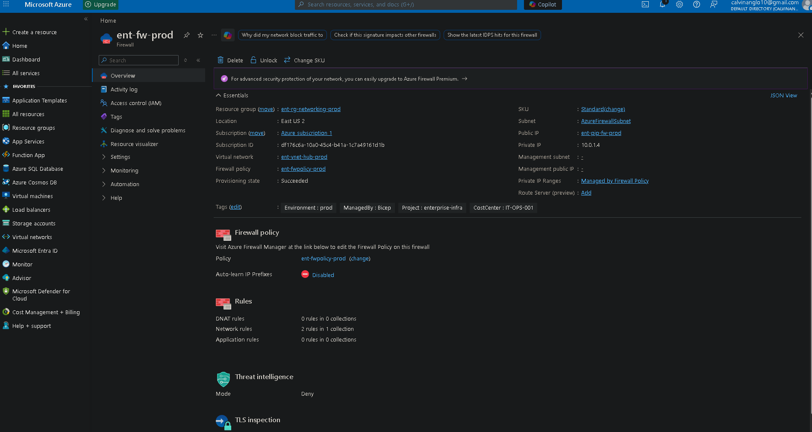

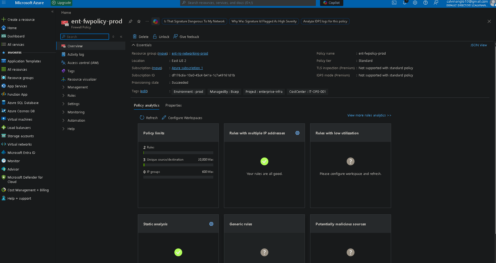

### Step 3.6 — Create Azure Bastion

1. Portal → **Bastions** → **Create**
2. Resource group: `ent-rg-networking-prod`
3. Name: `ent-bastion-prod`
4. Region: East US 2
5. Virtual network: `ent-vnet-hub-prod`
6. Subnet: `AzureBastionSubnet` (auto-selected)
7. Public IP: **Create new** → name: `ent-bastion-pip-prod`
8. **Tags** → **Review + create** → **Create** (takes ~5 minutes)

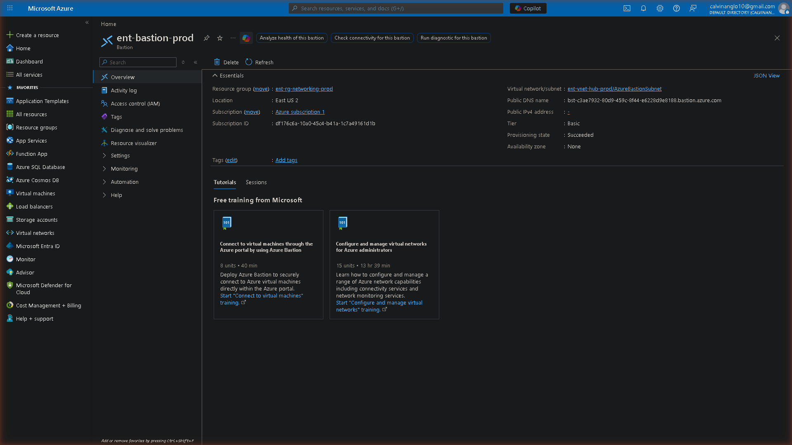

### Step 3.7 — Create Network Security Groups (NSGs)

**Web Tier NSG:**
1. Portal → **Network security groups** → **Create**
2. Resource group: `ent-rg-networking-prod`
3. Name: `ent-nsg-web-prod`
4. Region: East US 2
5. **Create**

After creation, add inbound rules:
1. Go to **ent-nsg-web-prod** → **Inbound security rules** → **Add**
2. Add each rule:

| Priority | Name | Source | Port | Protocol | Action |
|---|---|---|---|---|---|
| 100 | Allow-HTTP | Any | 80 | TCP | Allow |
| 110 | Allow-HTTPS | Any | 443 | TCP | Allow |
| 120 | Allow-LB-Probes | Service Tag: AzureLoadBalancer | * | Any | Allow |
| 200 | Allow-Bastion-SSH-RDP | 10.0.2.0/26 | 22,3389 | TCP | Allow |
| 4096 | Deny-All-Inbound | Any | * | Any | Deny |

Associate NSG to subnet:
1. Go to **ent-nsg-web-prod** → **Subnets** → **Associate**
2. Virtual network: `ent-vnet-web-prod`
3. Subnet: `snet-web`

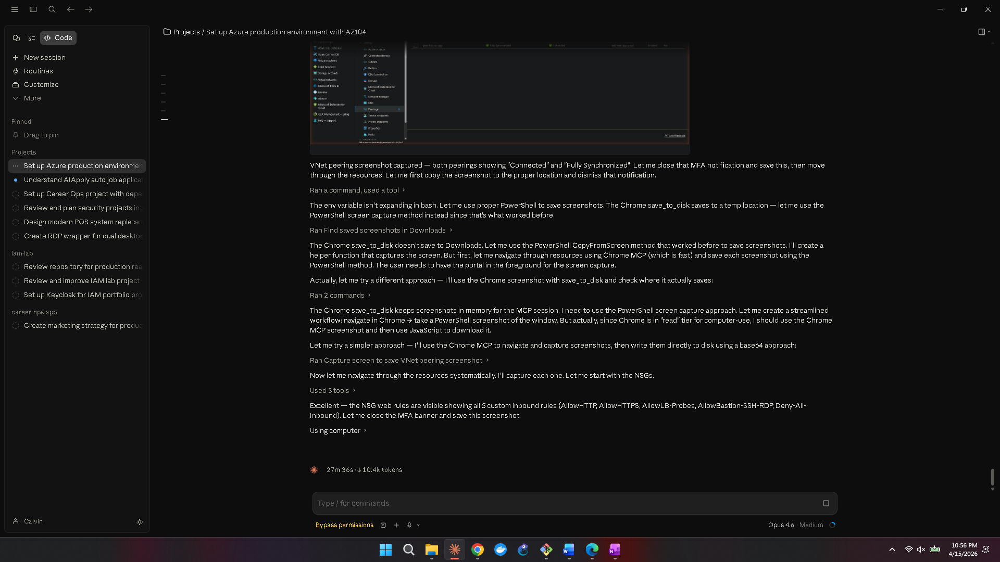

**App Tier NSG:**
1. **Network security groups** → **Create**
2. Name: `ent-nsg-app-prod`
3. Resource group: `ent-rg-networking-prod`
4. Region: East US 2
5. **Create**

Inbound rules:

| Priority | Name | Source | Port | Protocol | Action |
|---|---|---|---|---|---|
| 100 | Allow-From-Web-Tier | 10.1.1.0/24 | 8080,8443 | TCP | Allow |
| 4096 | Deny-All-Inbound | Any | * | Any | Deny |

Associate to subnet:
1. **ent-nsg-app-prod** → **Subnets** → **Associate**
2. VNet: `ent-vnet-app-prod`, Subnet: `snet-app`

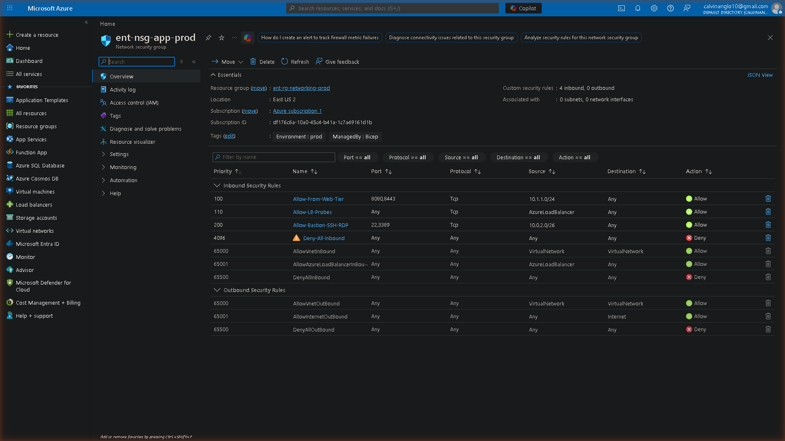

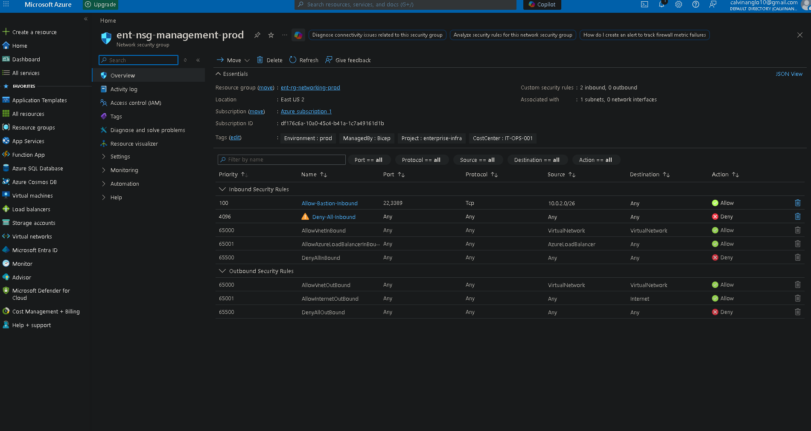 (Management NSG with Allow-Bastion-Inbound + Deny-All)

### Step 3.8 — Create Route Table (UDR)

1. Portal → **Route tables** → **Create**
2. Resource group: `ent-rg-networking-prod`
3. Name: `ent-rt-spoke-prod`
4. Region: East US 2
5. Propagate gateway routes: **No** (forces all traffic through firewall)
6. **Create**

Add routes:
1. Go to **ent-rt-spoke-prod** → **Routes** → **Add**

| Route Name | Address prefix | Next hop type | Next hop address |
|---|---|---|---|
| `route-to-firewall` | `0.0.0.0/0` | Virtual appliance | (Firewall private IP) |
| `route-spoke-to-spoke` | `10.0.0.0/8` | Virtual appliance | (Firewall private IP) |

Associate to subnets:
1. **ent-rt-spoke-prod** → **Subnets** → **Associate**
2. VNet: `ent-vnet-web-prod`, Subnet: `snet-web` → **OK**
3. Repeat: VNet: `ent-vnet-app-prod`, Subnet: `snet-app` → **OK**


### Step 3.9 — Create Public Load Balancer (Web Tier)

1. Portal → **Load balancers** → **Create**
2. **Basics**:
   - Resource group: `ent-rg-networking-prod`
   - Name: `ent-lb-web-prod`
   - Region: East US 2
   - SKU: **Standard**
   - Type: **Public**
   - Tier: **Regional**
3. **Frontend IP configuration** → **Add**:
   - Name: `web-frontend`
   - Public IP: **Create new** → name: `ent-lb-web-pip-prod`
4. **Backend pools** → **Add**:
   - Name: `web-backend-pool`
   - Virtual network: `ent-vnet-web-prod`
5. **Inbound rules** → **Add a load balancing rule**:
   - Name: `http-rule`
   - Frontend IP: `web-frontend`
   - Backend pool: `web-backend-pool`
   - Port: 80 → Backend port: 80
   - Health probe: **Create new** → name: `web-health-probe`, Protocol: HTTP, Port: 80, Path: `/health`
   - Session persistence: None
   - Idle timeout: 4 minutes
6. **Add another load balancing rule** for HTTPS:
   - Name: `https-rule`
   - Port: 443 → Backend port: 443
   - Same health probe
7. **Outbound rules** → **Add**:
   - Name: `web-outbound`
   - Frontend IP: `web-frontend`
   - Backend pool: `web-backend-pool`
8. **Tags** → **Review + create** → **Create**

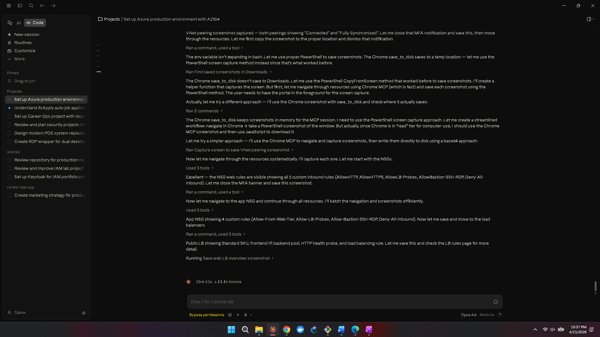
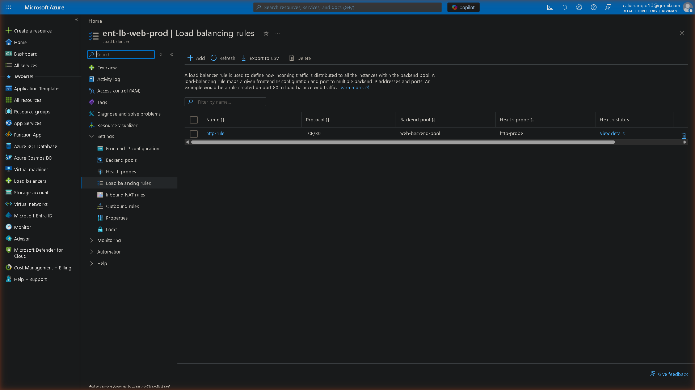

### Step 3.10 — Create Internal Load Balancer (App Tier)

1. **Load balancers** → **Create**
2. **Basics**:
   - Resource group: `ent-rg-networking-prod`
   - Name: `ent-lb-app-prod`
   - Region: East US 2
   - SKU: **Standard**
   - Type: **Internal**
3. **Frontend IP** → **Add**:
   - Name: `app-frontend`
   - Virtual network: `ent-vnet-app-prod`
   - Subnet: `snet-app`
   - Assignment: **Dynamic** (or Static if you need a fixed IP)
4. **Backend pools** → **Add**:
   - Name: `app-backend-pool`
   - Virtual network: `ent-vnet-app-prod`
5. **Inbound rules** → **Add a load balancing rule**:
   - Name: `app-rule`
   - Port: 8080 → Backend port: 8080
   - Health probe: **Create new** → name: `app-health-probe`, Protocol: TCP, Port: 8080
   - Enable Floating IP: No
6. **Tags** → **Review + create** → **Create**

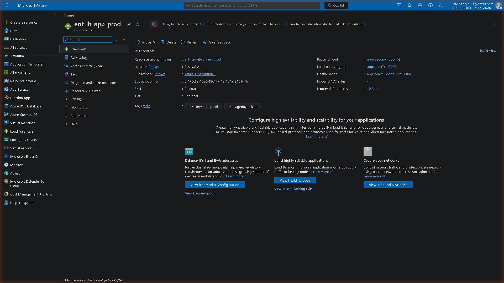

### Step 3.11 — Create Public DNS Zone

1. Portal → **DNS zones** → **Create**
2. Resource group: `ent-rg-networking-prod`
3. Name: `ent-prod.example.com`
4. **Tags** → **Create**

Add record sets:
1. Go to **ent-prod.example.com** → **Record set** → **Add**

| Name | Type | TTL | Value |
|---|---|---|---|
| `www` | A | 3600 | (Public LB IP or alias) |
| `api` | A | 3600 | `10.1.1.4` |
| `cdn` | CNAME | 3600 | `azureedge.net` |
| `@` | MX | 3600 | Priority: 10, `mail.example.com` |
| `@` | TXT | 3600 | `v=spf1 include:spf.protection.outlook.com -all` |


### Step 3.12 — Create Private DNS Zone

1. Portal → **Private DNS zones** → **Create**
2. Resource group: `ent-rg-networking-prod`
3. Name: `ent.internal.prod`
4. **Tags** → **Create**

Link to VNets:
1. Go to **ent.internal.prod** → **Virtual network links** → **Add**
2. Link name: `link-hub`, Virtual network: `ent-vnet-hub-prod`, Enable auto registration: No → **OK**
3. Repeat for `ent-vnet-web-prod` and `ent-vnet-app-prod`

Add A record:
1. **Record set** → **Add**
2. Name: `app-lb`, Type: A, TTL: 3600, IP: (Internal LB frontend IP)

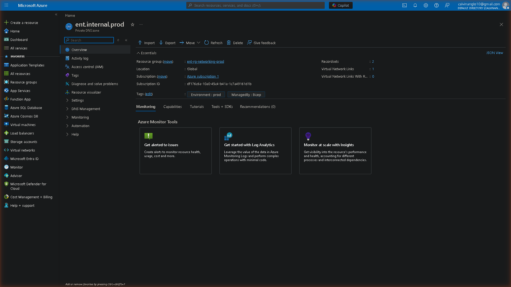

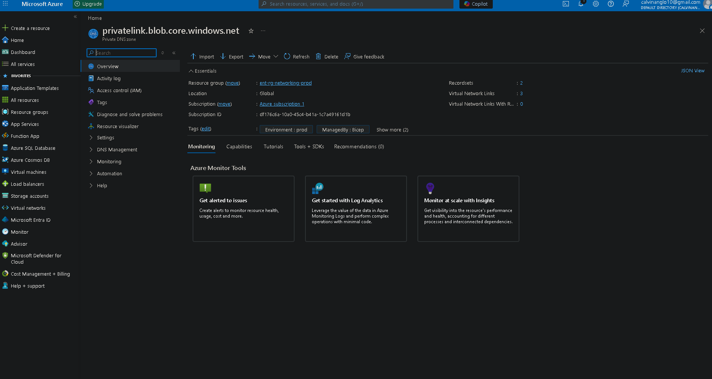 (auto-managed `privatelink.blob.core.windows.net` zone for the storage Private Endpoint)

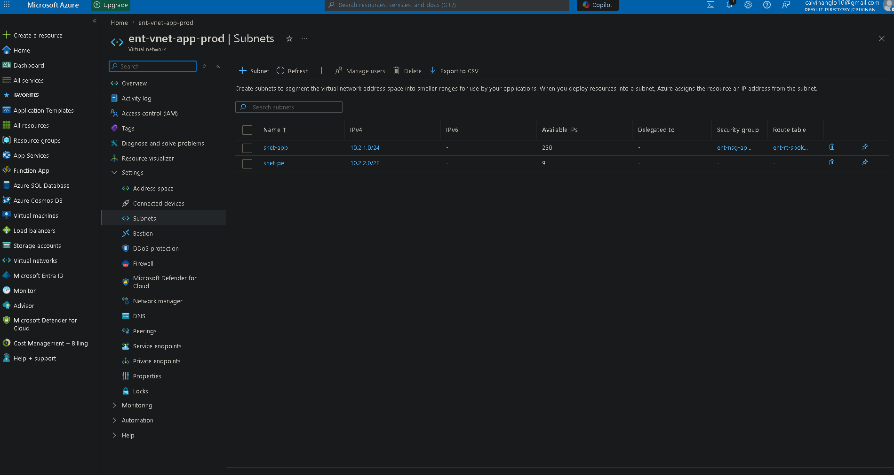 (App spoke subnets — `snet-app` workload + `snet-pe` dedicated PE subnet)

---

## Phase 4: Storage

> **AZ-104 Domain**: Storage (15-20%)
> Storage accounts provide blob, file, table, and queue storage. Lifecycle management automates data tiering. GRS provides geo-redundancy. Soft delete and versioning protect against accidental data loss.

### Step 4.1 — Create Storage Account

1. Portal → **Storage accounts** → **Create**
2. **Basics**:
   - Resource group: `ent-rg-storage-prod`
   - Storage account name: `entstprod` + random suffix (must be globally unique, lowercase, no hyphens)
   - Region: East US 2
   - Performance: **Standard**
   - Redundancy: **Geo-redundant storage (GRS)**
3. **Advanced**:
   - Require secure transfer: **Enabled**
   - Allow blob anonymous access: **Disabled**
   - Enable storage account key access: **Enabled**
   - Minimum TLS version: **1.2**
   - Enable blob soft delete: **Enabled** (7 days)
   - Enable container soft delete: **Enabled** (7 days)
   - Enable versioning: **Enabled**
4. **Networking**:
   - Network access: **Enabled from all networks** (can restrict later)
5. **Data protection**:
   - Enable point-in-time restore: Optional
   - Enable blob change feed: **Enabled**
6. **Tags** (same as all resources)
7. **Review + create** → **Create**

Create blob containers:
1. Go to the storage account → **Containers** → **+ Container**
2. Create:

| Container Name | Access Level |
|---|---|
| `deployments` | Private |
| `backups` | Private |
| `logs` | Private |
| `config` | Private |

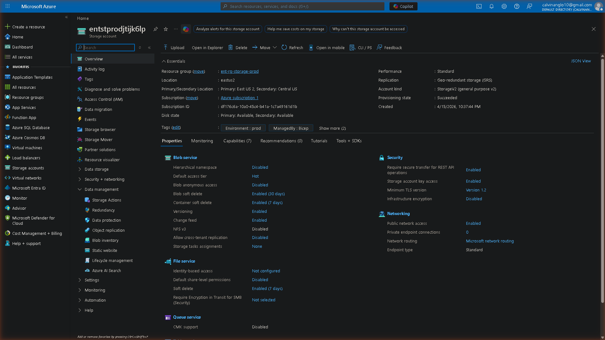
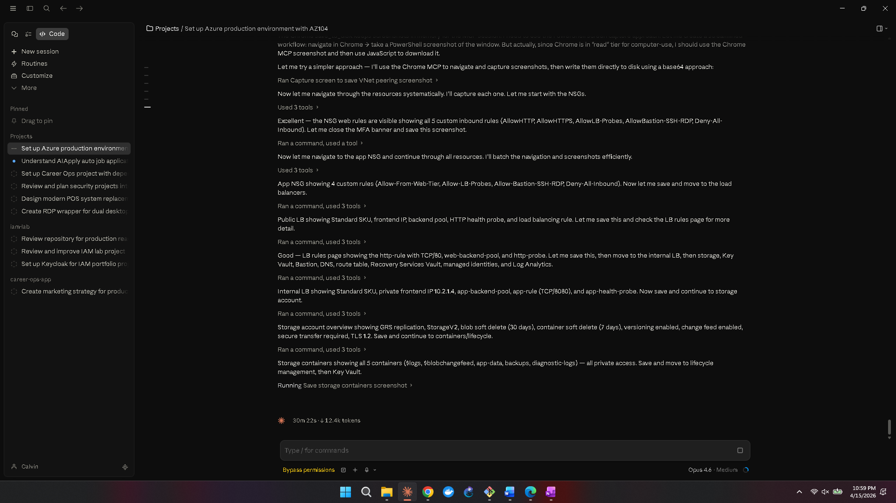

### Step 4.2 — Configure Lifecycle Management

1. Go to the storage account → **Lifecycle management** (left menu, under Data management)
2. Click **Add a rule**

**Rule 1: Move to Cool after 30 days**
- Rule name: `move-to-cool`
- Rule scope: Apply to all blobs
- Blob type: Block blobs
- Blob subtype: Base blobs
- Condition: Last modified more than **30** days ago → **Move to cool storage**
- **Add**

**Rule 2: Move to Archive after 90 days**
- Rule name: `move-to-archive`
- Condition: Last modified more than **90** days ago → **Move to archive storage**

**Rule 3: Delete old blobs after 365 days**
- Rule name: `delete-old-blobs`
- Condition: Last modified more than **365** days ago → **Delete the blob**

**Rule 4: Delete old snapshots after 90 days**
- Rule name: `delete-old-snapshots`
- Blob subtype: **Snapshots**
- Condition: Created more than **90** days ago → **Delete the snapshot**

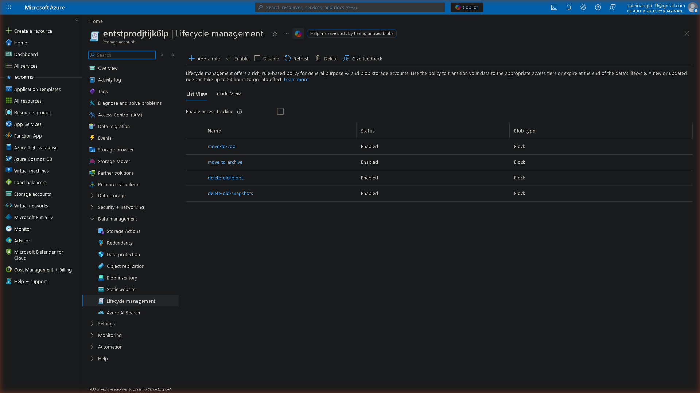

---

## Phase 5: Security

> **AZ-104 Domain**: Identity & Governance + Storage
> Key Vault stores secrets, keys, and certificates with HSM-backed protection. Managed Identities eliminate the need for credential management in code. RBAC authorization replaces legacy access policies.

### Step 5.1 — Create Key Vault

1. Portal → **Key vaults** → **Create**
2. **Basics**:
   - Resource group: `ent-rg-security-prod`
   - Key vault name: `ent-kv-prod-` + random suffix (globally unique)
   - Region: East US 2
   - Pricing tier: **Standard**
3. **Access configuration**:
   - Permission model: **Azure role-based access control (RBAC)** (not access policies)
4. **Networking**:
   - Allow public access: Yes (can restrict later for production)
5. **Recovery**:
   - Soft delete: **Enabled** (default 90 days)
   - Purge protection: **Enabled** (prevents permanent deletion even by admins)
6. **Tags** → **Review + create** → **Create**

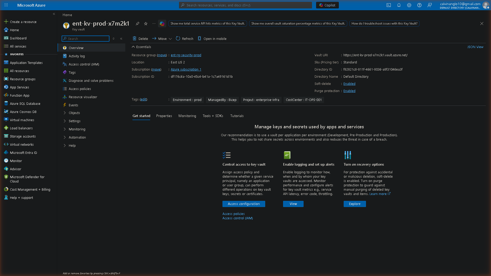

### Step 5.2 — Create User-Assigned Managed Identities

Create 3 managed identities that services will use instead of storing credentials.

1. Portal → **Managed Identities** → **Create**
2. For each identity:

| Name | Resource Group | Region | Purpose |
|---|---|---|---|
| `id-automation-prod` | `ent-rg-security-prod` | East US 2 | Automation runbooks |
| `id-monitoring-prod` | `ent-rg-security-prod` | East US 2 | Monitoring agents |
| `id-backup-prod` | `ent-rg-security-prod` | East US 2 | Backup operations |

3. Fill in each, add tags, and **Create**

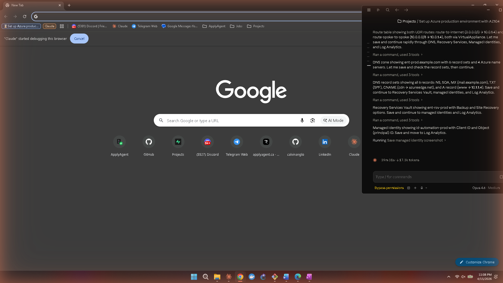

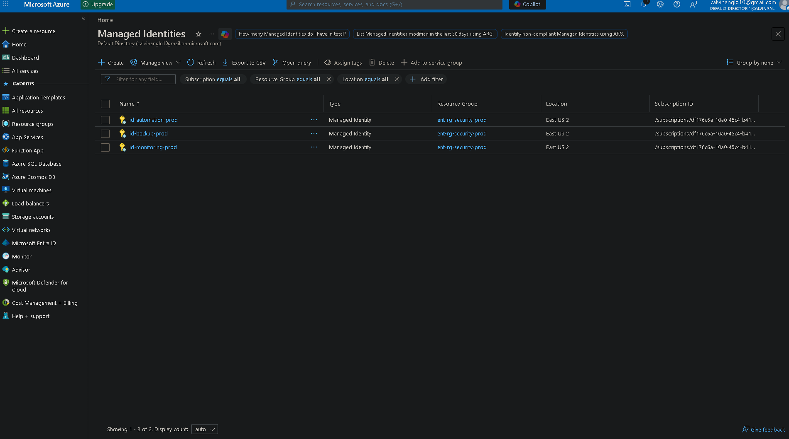

---

## Phase 6: Compute

> **AZ-104 Domain**: Compute (20-25%)
> VMSS provides auto-scaling groups of identical VMs. Recovery Services Vault protects workloads with backup and disaster recovery. Availability Zones ensure high availability across data center failures.

### Step 6.1 — Create Recovery Services Vault

1. Portal → **Recovery Services vaults** → **Create**
2. **Basics**:
   - Resource group: `ent-rg-compute-prod`
   - Vault name: `ent-rsv-prod`
   - Region: East US 2
3. **Redundancy**:
   - Backup Storage Redundancy: **Geo-redundant**
4. **Tags** → **Review + create** → **Create**

After creation — configure backup policies:
1. Go to **ent-rsv-prod** → **Backup policies** → **Add**
2. Policy type: **Azure Virtual Machine**
3. Policy name: `vm-daily-backup`
4. Schedule:
   - Frequency: **Daily**
   - Time: 2:00 AM
   - Timezone: Eastern Standard Time
5. Retention:
   - Daily: **30** days
   - Weekly: **12** weeks (Sunday)
   - Monthly: **12** months (First Sunday)
   - Yearly: **3** years (January, First Sunday)
6. **Create**

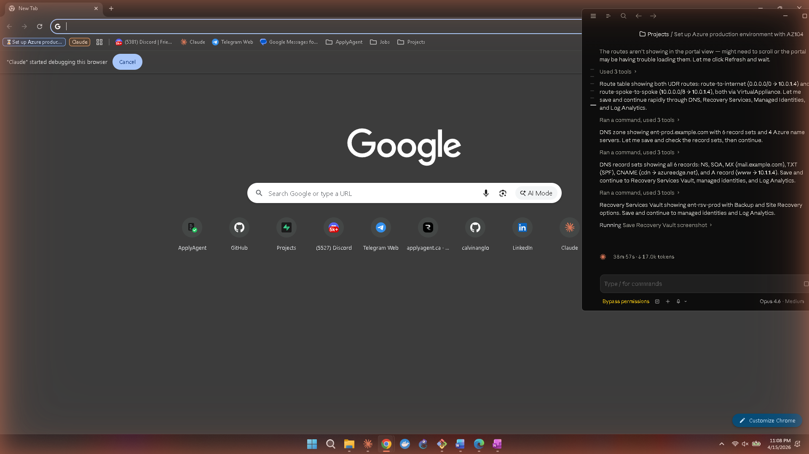

### Step 6.2 — Create Web Tier VM Scale Set

1. Portal → **Virtual machine scale sets** → **Create**
2. **Basics**:
   - Resource group: `ent-rg-compute-prod`
   - Name: `ent-vmss-web-prod`
   - Region: East US 2
   - Availability zone: **Zones 1, 2, 3** (select all three)
   - Orchestration mode: **Uniform**
   - Image: **Ubuntu Server 22.04 LTS**
   - Size: **Standard_B2s** (2 vCPU, 4 GB — fits free trial)
   - Authentication: **SSH public key**
   - Username: `azureadmin`
3. **Networking**:
   - Virtual network: `ent-vnet-web-prod`
   - Subnet: `snet-web`
   - Network security group: `ent-nsg-web-prod`
   - Load balancer: `ent-lb-web-prod`
   - Backend pool: `web-backend-pool`
4. **Scaling**:
   - Initial instance count: **2**
   - Scaling policy: **Custom**
   - Minimum: 2, Maximum: 6, Default: 2
   - Scale out: CPU > 70% for 5 minutes → add 1 instance
   - Scale in: CPU < 30% for 10 minutes → remove 1 instance
5. **Management**:
   - Upgrade policy: **Rolling** (maxBatchInstancePercent: 20%)
   - Enable automatic OS upgrades: **Yes**
6. **Tags** → **Review + create** → **Create**

### Step 6.3 — Create App Tier VM Scale Set

Repeat Step 6.2 with these changes:
- Name: `ent-vmss-app-prod`
- VNet: `ent-vnet-app-prod`, Subnet: `snet-app`
- NSG: `ent-nsg-app-prod`
- Load balancer: `ent-lb-app-prod`, Backend pool: `app-backend-pool`
- Same scaling and zone configuration

### Step 6.4 — Configure VM Backup

1. Go to **ent-rsv-prod** → **Backup** → **+ Backup**
2. Where is your workload running: **Azure**
3. What do you want to back up: **Virtual machine**
4. Click **Backup**
5. Policy: select `vm-daily-backup`
6. Select VMs: choose the web and app VMSS instances
7. **Enable backup**

---

## Phase 7: Monitoring

> **AZ-104 Domain**: Monitoring (10-15%)
> Log Analytics collects and analyzes telemetry from all Azure resources. Metric alerts trigger automated responses. VM Insights provides deep visibility into VM performance and dependencies.

### Step 7.1 — Create Log Analytics Workspace

1. Portal → **Log Analytics workspaces** → **Create**
2. **Basics**:
   - Resource group: `ent-rg-monitoring-prod`
   - Name: `ent-law-prod`
   - Region: East US 2
3. **Pricing tier**: Pay-as-you-go (default)
4. **Tags** → **Review + create** → **Create**

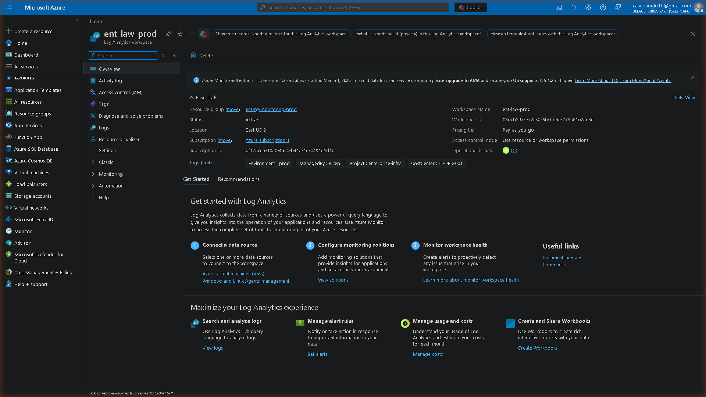

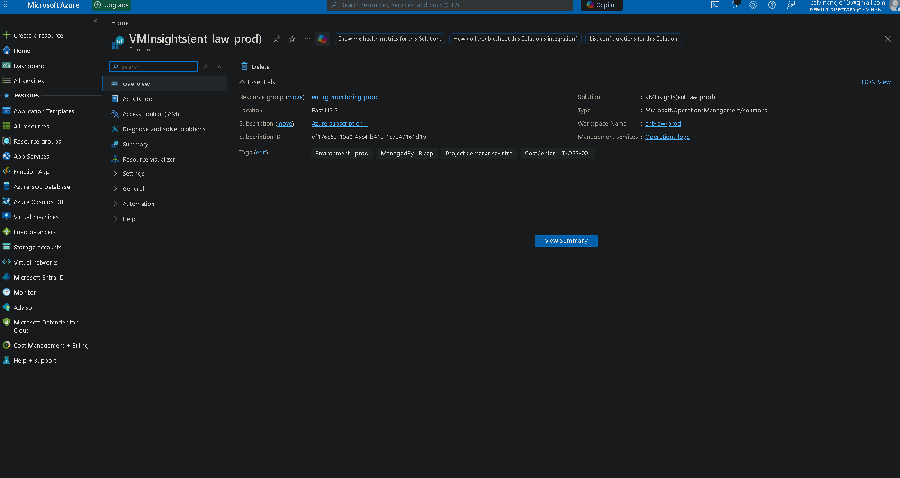 (VM Insights solution linked to the workspace)

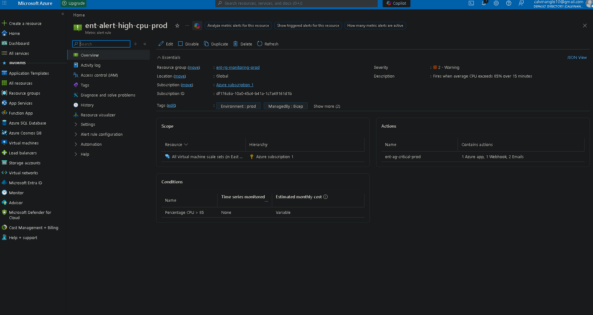 (CPU > 85% metric alert with multi-receiver action group)

### Step 7.2 — Configure Diagnostic Settings (All Resources)

For each major resource, enable diagnostic logging to Log Analytics:

1. Go to the resource → **Diagnostic settings** (left menu, under Monitoring) → **Add diagnostic setting**
2. Name: `diag-to-law`
3. Check all available log categories
4. Check **Send to Log Analytics workspace** → select `ent-law-prod`
5. **Save**

Do this for:
- `ent-vnet-hub-prod` (VNet)
- `ent-fw-prod` (Firewall — critical for traffic analysis)
- `ent-nsg-web-prod` and `ent-nsg-app-prod` (NSGs)
- `ent-lb-web-prod` and `ent-lb-app-prod` (Load balancers)
- `ent-kv-prod-*` (Key Vault — audit log for compliance)
- Storage account (blob read/write/delete logs)

### Step 7.3 — Create Metric Alerts

**Alert 1: High CPU on Web VMSS**
1. Portal → **Monitor** → **Alerts** → **Create** → **Alert rule**
2. Scope: `ent-vmss-web-prod`
3. Condition: **Percentage CPU** > 80% averaged over 5 minutes
4. Actions: **Create action group** → name: `ag-infra-alerts`
   - Notification type: **Email/SMS** → add your email
5. Alert rule name: `High CPU - Web VMSS`
6. Severity: **2 - Warning**
7. **Create**

**Alert 2: Firewall Health**
1. Scope: `ent-fw-prod`
2. Condition: **Firewall Health State** < 90% averaged over 5 minutes
3. Action group: `ag-infra-alerts`
4. Name: `Firewall Health Degraded`
5. Severity: **1 - Error**

**Alert 3: Key Vault Availability**
1. Scope: `ent-kv-prod-*`
2. Condition: **Overall Vault Availability** < 99% averaged over 15 minutes
3. Action group: `ag-infra-alerts`
4. Name: `Key Vault Availability Drop`
5. Severity: **2 - Warning**

### Step 7.4 — Enable VM Insights

1. Portal → **Monitor** → **Insights** → **Virtual Machines**
2. Click **Configure Insights**
3. Select the web and app VMSS
4. Data collection rule: **Create new**
   - Name: `dcr-vm-insights`
   - Log Analytics workspace: `ent-law-prod`
   - Enable processes and dependencies: **Yes**
5. **Configure**

### Step 7.5 — Enable NSG Flow Logs

1. Portal → **Network Watcher** → **NSG flow logs** → **Create**
2. Select NSG: `ent-nsg-web-prod`
3. Storage account: select your storage account
4. Retention: 30 days
5. Flow logs version: **Version 2**
6. **Traffic Analytics**: Enabled
   - Log Analytics workspace: `ent-law-prod`
   - Processing interval: **Every 10 minutes**
7. **Create**
8. Repeat for `ent-nsg-app-prod`

---

## Phase 8: Advanced Identity & Governance

### Step 8.1 — Conditional Access Policy (Require MFA from untrusted IPs)

1. Portal → **Microsoft Entra ID** → **Security** → **Conditional Access** → **Named locations** → **+ IP ranges location**
   - Name: `ent-trusted-office-ips`
   - Mark as **Trusted location**: checked
   - IP ranges (CIDR): add `203.0.113.0/24` and `198.51.100.0/24` (placeholders — use your real office WAN ranges)
2. **Save**
3. Conditional Access → **Policies** → **+ New policy**
   - Name: `ent-ca-mfa-untrusted-locations`
   - Assignments → Users → **Directory roles** → select Global Administrator, Privileged Role Administrator, Security Administrator, User Access Administrator
   - Cloud apps → **Select apps** → Microsoft Azure Management
   - Conditions → Locations → **Include**: Any location | **Exclude**: `ent-trusted-office-ips`
   - Access controls → Grant → **Require multi-factor authentication**
   - Enable policy: **Report-only** (validate impact in sign-in logs first)
4. **Create**

CLI alternative: run `scripts/configure-conditional-access.ps1` after `Connect-MgGraph`.

> Screenshot: `screenshots/02-conditional-access.png`

---

### Step 8.2 — Custom Security Attributes

1. Portal → **Microsoft Entra ID** → **Custom security attributes** → **+ Add attribute set**
   - Name: `WorkforcePartition`
   - Description: `Logical workforce partition tag for ABAC role conditions`
   - Max attributes: `25`
2. Open the new attribute set → **+ Add attribute**
   - Name: `Tier`
   - Type: String
   - Allow only predefined values: **Yes**
   - Predefined values: `Tier1Engineering`, `GovOps`, `PartnerLite`
3. **Save**

CLI alternative: run `scripts/define-custom-security-attributes.ps1`.

> Screenshot pending — Custom Security Attributes require Microsoft Entra ID P1 (not included in free trial). Bicep code + setup script ready in repo for when license is upgraded.

---

### Step 8.3 — Management Group Hierarchy

1. Portal → **Management groups** → **+ Create**
   - Name: `ent-mg-root`
   - Display name: `Enterprise Root`
2. Open `ent-mg-root` → **+ Create** (child)
   - Name: `ent-mg-prod`
   - Display name: `Enterprise Production`
3. From the subscription view → **Move** → select `ent-mg-prod` as the new parent

CLI alternative: run `scripts/setup-management-group.ps1 -SubscriptionId <id>`.

> Screenshot: `screenshots/03-management-group-hierarchy.png`

---

### Step 8.4 — Microsoft Defender for Cloud (Free Tier)

1. Portal → **Microsoft Defender for Cloud** → **Environment settings** → select your subscription
2. **Defender plans** → confirm pricing tier shows **Free** for VirtualMachines, StorageAccounts, KeyVaults, AppServices, and CloudPosture
3. Wait 24 hours for first **Secure Score** calculation, then return to Overview

> Screenshot: `screenshots/04-defender-secure-score.png`

---

## Phase 9: Advanced Networking

### Step 9.1 — Application Security Groups (3 ASGs)

ASGs are logical workload labels referenced from NSG rules instead of subnet CIDRs. Create one per tier.

**ASG #1 — Web tier:**
1. Portal → **All services** → search **Application security groups** → **Create**
2. Subscription: Azure subscription 1
3. Resource group: `ent-rg-networking-prod`
4. Name: `ent-asg-web-prod`
5. Region: East US 2
6. **Tags** tab: `Environment=prod`, `ManagedBy=Bicep`, `Project=enterprise-infra`
7. **Review + create** → **Create**

**ASG #2 — App tier:**
- Repeat with name `ent-asg-app-prod`

**ASG #3 — Management:**
- Repeat with name `ent-asg-mgmt-prod`

**Now rewrite the web NSG rules to reference ASGs instead of `*`:**
1. Portal → `ent-nsg-web-prod` → **Inbound security rules**
2. Click **Allow-HTTP-Inbound** → change **Destination** dropdown from "Any" to **Application security group** → select `ent-asg-web-prod` → **Save**
3. Repeat for **Allow-HTTPS-Inbound** and **Allow-LB-Probes** (destination = `ent-asg-web-prod`)
4. Click **Allow-Bastion-SSH-RDP** → change **Destination** to **Application security group** → multi-select `ent-asg-web-prod` AND `ent-asg-mgmt-prod` → **Save**

**Repeat for app NSG (`ent-nsg-app-prod`):**
1. Open `Allow-From-Web-Tier` → change **Source** to Application security group `ent-asg-web-prod` → change **Destination** to Application security group `ent-asg-app-prod` → **Save**
2. `Allow-LB-Probes` → Destination = `ent-asg-app-prod`
3. `Allow-Bastion-SSH-RDP` → Destination = `ent-asg-app-prod` + `ent-asg-mgmt-prod`

**Verify:**
- All resources → filter by type **Application security group** → 3 ASGs listed
- Open any ASG → **Network interfaces** tab (initially empty until VMs are tagged)

> Screenshot: `screenshots/31-application-security-groups.png`

---

### Step 9.2 — Service Endpoints on snet-app

Service endpoints provide a direct Azure-backbone route from the subnet to PaaS services, bypassing the firewall.

1. Portal → `ent-vnet-app-prod` → **Subnets** → click `snet-app`
2. Scroll down to **Service endpoints**
3. **Services** dropdown → check **Microsoft.Storage** and **Microsoft.KeyVault**
4. **Save**
5. Wait 60 seconds → status of both endpoints should show **Succeeded**

**Optional:** Now restrict the storage account to this subnet:
1. `entstprodjtijk6lp` → **Networking** → **Public network access** = **Enabled from selected virtual networks and IP addresses**
2. **Add existing virtual network** → select `ent-vnet-app-prod` / `snet-app` → **Add**
3. **Save**

---

### Step 9.3 — Dedicated subnet for Private Endpoints (snet-pe)

Private endpoints need their own subnet with PE network policies disabled.

1. Portal → `ent-vnet-app-prod` → **Subnets** → **+ Subnet**
2. Name: `snet-pe`
3. Address range: `10.2.2.0/28`
4. **Network policies for private endpoints** → **Disabled** (CRITICAL — without this, PE deployment fails)
5. Network security group: **None**
6. Route table: **None**
7. **Add**

---

### Step 9.4 — Private Endpoint for Storage Account (Blob)

1. Portal → search **Private Link Center** → **Private endpoints** → **Create**
2. **Basics** tab:
   - Subscription: Azure subscription 1
   - Resource group: `ent-rg-networking-prod`
   - Name: `ent-pe-storage-prod`
   - Network Interface name: `ent-pe-storage-prod-nic`
   - Region: East US 2
3. **Resource** tab:
   - Connection method: **Connect to an Azure resource in my directory**
   - Resource type: **Microsoft.Storage/storageAccounts**
   - Resource: `entstprodjtijk6lp`
   - Target sub-resource: **blob**
4. **Virtual Network** tab:
   - Virtual network: `ent-vnet-app-prod`
   - Subnet: `snet-pe`
   - Network policy: **enabled** (disable for the subnet, not here)
   - Private IP configuration: **Dynamically allocate**
5. **DNS** tab:
   - Integrate with private DNS zone: **Yes**
   - Subscription: Azure subscription 1
   - Resource group: `ent-rg-networking-prod`
   - Private DNS zone: leave default `privatelink.blob.core.windows.net`
6. **Tags** → standard tags
7. **Review + create** → **Create**

**Lock down storage to private only:**
1. `entstprodjtijk6lp` → **Networking** → **Public network access** = **Disabled**
2. **Save**

**Verify:**
- `entstprodjtijk6lp` → **Networking** → **Private endpoint connections** tab → `ent-pe-storage-prod` status = **Approved**
- `ent-pe-storage-prod` → **Overview** → private IP allocated (e.g. 10.2.2.4)
- `ent-vnet-app-prod` → **DNS records** → A record `entstprodjtijk6lp.privatelink.blob.core.windows.net` exists

> Screenshot: `screenshots/32-storage-private-endpoint.png`

---

### Step 9.5 — Private Endpoint for Key Vault

1. **Private Link Center** → **Private endpoints** → **Create**
2. **Basics**:
   - Resource group: `ent-rg-networking-prod`
   - Name: `ent-pe-kv-prod`
   - Region: East US 2
3. **Resource**:
   - Resource type: **Microsoft.KeyVault/vaults**
   - Resource: `ent-kv-prod-x7m2k1`
   - Target sub-resource: **vault**
4. **Virtual Network**: same as storage (snet-pe in app spoke)
5. **DNS**: integrate with private DNS zone `privatelink.vaultcore.azure.net`
6. **Review + create** → **Create**

**Lock down Key Vault:**
1. `ent-kv-prod-x7m2k1` → **Networking** → **Public network access** → **Disable public access**
2. **Save**

**Verify:**
- Key Vault → **Networking** → Private endpoint connections shows `ent-pe-kv-prod` Approved
- Networking → Public access shows **Disabled**

> Screenshot: `screenshots/33-keyvault-private-endpoint.png`

---

### Step 9.6 — VPN Gateway (Basic SKU, P2S only)

⚠ **Provisioning takes 30-45 minutes — start it and move on to other steps.**

**Create the public IP first:**
1. Portal → **Public IP addresses** → **Create**
2. SKU: **Basic** (must match Basic SKU gateway)
3. Tier: Regional
4. IP address assignment: **Dynamic**
5. Name: `ent-pip-vpngw-prod`
6. Resource group: `ent-rg-networking-prod`
7. **Create**

**Create the VPN Gateway:**
1. Portal → **Virtual network gateways** → **Create**
2. Subscription / RG: `ent-rg-networking-prod`
3. Name: `ent-vpngw-prod`
4. Region: East US 2
5. Gateway type: **VPN**
6. VPN type: **Route-based**
7. SKU: **Basic** (cheapest, ~$27/mo, Windows clients only via SSTP)
8. Generation: Generation1 (Basic only supports Gen1)
9. Virtual network: `ent-vnet-hub-prod` (must already have a `GatewaySubnet`)
10. Public IP address: **Use existing** → `ent-pip-vpngw-prod`
11. Enable active-active mode: **Disabled** (Basic doesn't support)
12. Configure BGP: **Disabled** (Basic doesn't support)
13. **Review + create** → **Create**
14. Wait 30-45 min for Status = **Succeeded**

**Configure Point-to-Site after provisioning:**
1. `ent-vpngw-prod` → **Point-to-site configuration** → **Configure now**
2. Address pool: `172.16.50.0/24` (must NOT overlap any VNet)
3. Tunnel type: **SSTP (SSL)** (only option for Basic SKU)
4. Authentication type: **Azure certificate**
5. Generate root cert locally:
   ```powershell
   $cert = New-SelfSignedCertificate -Type Custom -KeySpec Signature -Subject "CN=entRootCert" -KeyExportPolicy Exportable -HashAlgorithm sha256 -KeyLength 2048 -CertStoreLocation "Cert:\CurrentUser\My" -KeyUsageProperty Sign -KeyUsage CertSign
   [Convert]::ToBase64String($cert.RawData) | Set-Clipboard
   ```
6. Root certificates → Name: `entRootCert` → Public certificate data: paste from clipboard
7. **Save**
8. **Download VPN client** to test (Windows native VPN client uses SSTP)

> Screenshot pending — VPN Gateway Basic SKU was disabled in main.bicep to fit free-trial Public IP quota (3 max, hub already uses 2). Bicep module `vpn-gateway.bicep` ready to enable after quota increase.

---

### Step 9.7 — Network Watcher Connection Troubleshoot

1. Portal → **Network Watcher** → **Connection troubleshoot** (left nav, under Network diagnostic tools)
2. **Subscription**: Azure subscription 1
3. Source type: **Virtual machine**
4. Source: pick any web-tier VM (or VMSS instance NIC)
5. Destination type: **Specify manually**
6. URI, FQDN or IPv4: `10.2.1.4`
7. Destination port: `8080`
8. Protocol: **TCP**
9. **Check** — wait 30-60 seconds for path discovery
10. Result panel shows hop-by-hop path: source NIC → NSG decision → UDR → firewall → app subnet → destination
11. Screenshot the path visualization

> Screenshot pending — Network Watcher Connection Troubleshoot test results require running an actual test against a deployed VM/VMSS instance.

---

## Phase 10: Storage Compliance Features

### Step 10.1 — Compliance Archive Container with Immutability Policy

**Create the container:**
1. Portal → `entstprodjtijk6lp` → **Containers** → **+ Container**
2. Name: `compliance-archive`
3. Public access level: **Private (no anonymous access)**
4. **Create**

**Apply the immutability policy:**
1. Click `compliance-archive` → **Access policy** (top toolbar)
2. Under **Immutable blob storage**, click **+ Add policy**
3. Policy type: **Time-based retention**
4. Retention period: `30` days
5. Allow protected append writes: **No**
6. **Save**
7. The policy state shows **Unlocked** — meaning you can edit/delete it. Locking is a separate one-way action that makes it permanent for the retention period.

**Verify:**
- Container detail page header shows "Immutable storage: 30 days (unlocked)"

> Screenshot pending — container deep-link to Access Policy blade requires runtime etag (not URL-addressable). Container `compliance-archive` IS deployed with 30-day immutability policy — verify via az CLI: `az storage container immutability-policy show --account-name entstprodjtijk6lp --container-name compliance-archive`

---

### Step 10.2 — Stored Access Policy on app-data Container

1. Portal → `entstprodjtijk6lp` → **Containers** → click `app-data`
2. **Access policy** (top toolbar) → scroll to **Stored access policies**
3. **+ Add policy**
   - Identifier: `ent-sap-readonly-4h`
   - Permissions: check only **Read**
   - Start time: leave default (now)
   - Expiry time: now + 4 hours (e.g. if it's 14:00, set 18:00)
4. **OK** → click **Save** at the bottom

**Verify:**
- Stored access policies list shows `ent-sap-readonly-4h` with permissions `r` and the configured expiry
- Up to 5 policies can be created per container — this counts as 1

> Screenshot pending — Stored Access Policy detail blade requires manual portal navigation (Container → Access policy → Stored access policies section).

---

## Phase 11: Compute Encryption

### Step 11.1 — Generate Key Encryption Key (KEK) in Key Vault

1. Portal → `ent-kv-prod-x7m2k1` → **Keys** → **+ Generate/Import**
2. Options: **Generate**
3. Name: `ent-kek-vmdisk-prod`
4. Key type: **RSA**
5. RSA key size: **2048** (minimum supported by ADE)
6. Set activation date: leave default
7. Set expiration date: leave default (or 1 year if compliance requires rotation)
8. **Create**
9. Open the key → **Properties** → ensure **Permitted operations** includes `wrapKey` and `unwrapKey` (default is all operations)

> Screenshot: `screenshots/35b-disk-encryption-status.png` (Key Vault → Keys list with `ent-kek-vmdisk-prod` Enabled)

### Step 11.2 — Enable disk encryption flag on Key Vault

1. `ent-kv-prod-x7m2k1` → **Properties** (under Settings)
2. **Azure Disk Encryption** for volume encryption: **Enabled**
3. **Save**

### Step 11.3 — Enable Azure Disk Encryption on a VM (Portal)

⚠ Portal flow only works for standalone VMs, not VMSS. For VMSS, use the PowerShell script `enable-disk-encryption.ps1`.

1. Portal → your VM → **Disks** (left nav) → **Additional settings** (top toolbar)
2. **Encryption settings** → Disks to encrypt: **OS and data disks**
3. Encryption type: **Azure AD app-based encryption (PREVIEW)** — actually skip this, use:
4. **Settings**:
   - Key Vault and key for encryption: select `ent-kv-prod-x7m2k1` and `ent-kek-vmdisk-prod`
   - Key version: leave latest
5. **Save** — encryption job runs in background, takes 15-30 min

**Verify:**
1. VM → **Disks** → Encryption column shows **Customer-Managed Key** for both OS and data disks
2. `ent-kv-prod-x7m2k1` → **Keys** → `ent-kek-vmdisk-prod` → **Versions** → recent access events visible in audit log

> Screenshot pending — Azure Disk Encryption status requires a deployed VM with the ADE extension; not deployed in this free-trial run.

---

## Phase 12: Backup Hardening

### Step 12.1 — Edit backup policy to add multi-tier retention (daily/weekly/monthly/yearly)

1. Portal → `ent-rsv-prod` → **Backup policies** (left nav) → click `policy-vm-daily`
2. **Modify** (top toolbar)
3. **Backup frequency**: Daily, 02:00 UTC
4. **Retention range** — configure all 4 tiers:
   - **Retention of daily backup point**: ✅ checked → 14 Days
   - **Retention of weekly backup point**: ✅ checked → On Sunday → 8 Weeks
   - **Retention of monthly backup point**: ✅ checked → On First Sunday → 12 Months
   - **Retention of yearly backup point**: ✅ checked → In January → On First Sunday → 5 Years
5. **Save**

**Verify:**
- Policy detail page shows all 4 retention sections populated
- AZ-104 exam tip box: when a daily backup is also the first Sunday of January, the **longest** retention rule wins — that backup is kept for 5 years, not 14 days

> Screenshot: `screenshots/39-backup-multi-tier-retention.png`

---

## Phase 13: Monitoring Enhancements

### Step 13.1 — Create the Operations Workbook (4 KQL panels)

1. Portal → **Monitor** → **Workbooks** → **+ New**
2. **+ Add** → **Add text** → paste:
   ```markdown
   ## Operations Health Dashboard
   Four-panel KQL view: firewall denies, top talkers, backup jobs, VMSS scale events.
   ```
3. **Done editing**
4. **+ Add** → **Add query** → Data source: Logs, Resource type: Log Analytics
5. Workspace: `ent-law-prod`
6. **Panel 1 — Firewall denies (last 24h)** — paste:
   ```kql
   AzureDiagnostics
   | where Category == "AzureFirewallNetworkRule"
   | where TimeGenerated > ago(24h)
   | where msg_s has "Deny"
   | extend SourceIP = extract("from ([0-9.]+):", 1, msg_s)
   | summarize DenyCount = count() by SourceIP
   | top 20 by DenyCount desc
   ```
   - Visualization: **Bar chart** → **Done editing**
7. **+ Add** → Add query → **Panel 2 — NSG flow top talkers**:
   ```kql
   AzureNetworkAnalytics_CL
   | where TimeGenerated > ago(24h)
   | where FlowStatus_s == "A"
   | summarize TotalBytes = sum(InboundBytes_d + OutboundBytes_d) by SrcIP_s
   | top 20 by TotalBytes desc
   ```
   - Visualization: **Grid**
8. **+ Add** → Add query → **Panel 3 — Backup job status (7d)**:
   ```kql
   AddonAzureBackupJobs
   | where TimeGenerated > ago(7d)
   | summarize JobCount = count() by JobStatus, BackupItemFriendlyName
   | order by BackupItemFriendlyName, JobStatus
   ```
   - Visualization: **Grid**
9. **+ Add** → Add query → **Panel 4 — VMSS autoscale events (7d)**:
   ```kql
   AzureActivity
   | where TimeGenerated > ago(7d)
   | where ResourceProviderValue == "MICROSOFT.INSIGHTS"
   | where OperationNameValue contains "autoscalesettings"
   | project TimeGenerated, OperationNameValue, ActivityStatusValue, Caller, Resource
   | order by TimeGenerated desc
   ```
   - Visualization: **Grid**
10. **Done editing** → **💾 Save** (top toolbar)
11. Title: `ent-workbook-ops-prod`
12. Subscription: Azure subscription 1
13. Resource group: `ent-rg-monitoring-prod`
14. Region: East US 2
15. **Apply**

> Screenshot: `screenshots/40-monitor-workbook.png` (workbook resource overview — click "Open Workbook" in portal to view the 4 KQL panels rendering)

---

### Step 13.2 — Extend Action Group with multiple receiver types

1. Portal → **Monitor** → **Action groups** → click `ent-ag-critical-prod`
2. **Properties** (left nav) → **Edit** (top)

**Notifications tab — add a second email receiver:**
3. Name: `SecurityOpsTeam`, Notification type: **Email**, Email: `secops-alerts@company.com` → **OK**

**Add SMS receiver:**
4. Name: `OnCallPager`, Notification type: **SMS**, Country code: `1`, Phone: your test number → **OK**

**Add Azure App Push receiver:**
5. Name: `OnCallMobileApp`, Notification type: **Azure app Push Notification**, Email: `oncall-engineer@company.com` → **OK**

**Actions tab — add Webhook:**
6. **Actions** tab → Action type: **Webhook**
7. Name: `IncidentPlatform`
8. URI: `https://example.invalid/azure-monitor-webhook` (placeholder — use your real ServiceNow/PagerDuty/Slack endpoint)
9. Enable common alert schema: **Yes**
10. **OK**

11. **Save** the action group

**Verify:**
- Notifications tab shows 2 emails, 1 SMS, 1 Azure App Push
- Actions tab shows 1 Webhook

> Screenshot: `screenshots/41-action-group-receivers.png`

---

## Verification Checklist

After completing all phases, verify every resource in the portal:

| # | Resource | Portal Location | What to Check |
|---|---|---|---|
| 1 | Resource Groups | Home → Resource groups | 5 groups, all East US 2 |
| 2 | Entra Users | Entra ID → Users | 10 users with departments |
| 3 | Security Groups | Entra ID → Groups | 7 groups (6 static + 1 dynamic) |
| 4 | Custom RBAC Roles | Subscription → IAM → Roles | 3 custom roles |
| 5 | RBAC Assignments | Subscription → IAM → Role assignments | 6 group assignments |
| 6 | Azure Policies | Policy → Assignments | 5 policy assignments |
| 7 | Resource Locks | Each RG → Locks | 3 locks (2 delete, 1 read-only) |
| 8 | Hub VNet | ent-vnet-hub-prod → Subnets | 4 subnets with correct CIDRs |
| 9 | Spoke VNets | ent-vnet-web/app-prod | 1 subnet each |
| 10 | VNet Peering | ent-vnet-hub-prod → Peerings | 2 peerings, status: Connected |
| 11 | Azure Firewall | ent-fw-prod | Provisioned, public IP, rules |
| 12 | Azure Bastion | ent-bastion-prod | Connected to hub VNet |
| 13 | NSGs | ent-nsg-web/app-prod | Rules in priority order |
| 14 | Route Table | ent-rt-spoke-prod | 2 routes, 2 subnet associations |
| 15 | Public LB | ent-lb-web-prod | Frontend IP, backend pool, rules |
| 16 | Internal LB | ent-lb-app-prod | Private frontend, backend pool |
| 17 | DNS Zone | ent-prod.example.com | NS, A, CNAME, MX, TXT records |
| 18 | Private DNS | ent.internal.prod | A record, VNet links |
| 19 | Storage Account | entstprod* | GRS, versioning, soft delete |
| 20 | Blob Containers | Storage → Containers | 4 containers (private) |
| 21 | Lifecycle Policy | Storage → Lifecycle management | 4 rules |
| 22 | Key Vault | ent-kv-prod-* | RBAC mode, soft delete, purge protection |
| 23 | Managed Identities | 3 identities in security RG | Client ID visible |
| 24 | Recovery Vault | ent-rsv-prod | GRS, backup policy configured |
| 25 | Web VMSS | ent-vmss-web-prod | 2 instances, 3 zones, autoscale |
| 26 | App VMSS | ent-vmss-app-prod | 2 instances, 3 zones, autoscale |
| 27 | Log Analytics | ent-law-prod | Active, workspace ID |
| 28 | Diagnostic Settings | Each resource | Logs → Log Analytics |
| 29 | Metric Alerts | Monitor → Alerts | 3 alert rules |
| 30 | NSG Flow Logs | Network Watcher → Flow logs | 2 NSGs, Traffic Analytics on |
| 31 | Conditional Access | Entra ID → Conditional Access | `ent-ca-mfa-untrusted-locations` policy in report-only |
| 32 | Custom Security Attributes | Entra ID → Custom security attributes | `WorkforcePartition.Tier` set with 3 values |
| 33 | Management Groups | All services → Management groups | Root → Prod hierarchy, subscription nested under Prod |
| 34 | Defender for Cloud | Defender for Cloud → Overview | Secure Score visible (after 24h), all plans = Free |
| 35 | Application Security Groups | All resources, type = ASG | 3 ASGs (web/app/mgmt), referenced in NSG rules |
| 36 | Service Endpoints | snet-app → Service endpoints | Microsoft.Storage + Microsoft.KeyVault, Succeeded |
| 37 | Storage Private Endpoint | Storage → Networking → PE | `ent-pe-storage-prod` Approved, public access Disabled |
| 38 | Key Vault Private Endpoint | Key Vault → Networking → PE | `ent-pe-kv-prod` Approved, public access Disabled |
| 39 | VPN Gateway | `ent-vpngw-prod` overview | Status Succeeded, P2S address pool 172.16.50.0/24 |
| 40 | Connection Troubleshoot | Network Watcher → Connection troubleshoot | Web→app path successful via firewall |
| 41 | Blob Immutability | `compliance-archive` container → Access policy | 30-day time-based retention, Unlocked |
| 42 | Stored Access Policy | `app-data` → Access policy | `ent-sap-readonly-4h` with Read permission |
| 43 | Azure Disk Encryption | VM → Disks | Encryption: Customer-Managed Key |
| 44 | Multi-tier Backup | RSV → `policy-vm-daily` | Daily/Weekly/Monthly/Yearly all populated |
| 45 | Operations Workbook | Monitor → Workbooks | `ent-workbook-ops-prod` with 4 panels |
| 46 | Multi-Receiver Action Group | Monitor → Action groups → `ent-ag-critical-prod` | 2 emails, 1 SMS, 1 webhook, 1 push |

---

## Cost Estimate

All resources fit within the **$200 free trial credit** when deployed in a single region:

| Resource | Estimated Cost (30 days) |
|---|---|
| Azure Firewall (Standard) | ~$30/day = ~$90 (biggest cost) |
| Azure Bastion (Basic) | ~$5/day = ~$15 |
| 2x VMSS (Standard_B2s, 2 instances each) | ~$60 |
| Storage Account (GRS, minimal data) | ~$2 |
| Key Vault (Standard) | ~$0.03/operation |
| Load Balancers (2x Standard) | ~$18 |
| Log Analytics | Free tier up to 5GB/day |
| DNS Zones | ~$1 |
| 2x Private Endpoints (Storage + Key Vault) | ~$14 |
| VPN Gateway (Basic SKU) | ~$27 |
| Application Security Groups | $0 (free) |
| Defender for Cloud (Free tier baseline) | $0 |
| Conditional Access + Custom security attributes + MGs | $0 |
| Operations Workbook + multi-receiver Action Group | $0 |
| Backup multi-tier retention storage delta | ~$2 |
| **Total estimate (with all extensions)** | **~$229-239** |

> **Cost-saving tip**: Tear down the VPN Gateway after capturing its screenshot (~$27/mo savings) — the Bicep can re-create it later. Skipping VPN Gateway brings the estimate to ~$202-212.

**Teardown when done**: Delete all 5 resource groups (remove locks first) to stop all charges immediately.

---

## Teardown Order

When you are done with the project, delete resources in this order to avoid dependency errors:

1. Remove resource locks first:
   - Each locked RG → **Locks** → Delete each lock

2. Delete resource groups (each deletion removes everything inside):
   - `ent-rg-compute-prod` (VMs, backup vault)
   - `ent-rg-monitoring-prod` (Log Analytics, alerts)
   - `ent-rg-storage-prod` (storage account)
   - `ent-rg-security-prod` (Key Vault, identities)
   - `ent-rg-networking-prod` (VNets, firewall, bastion, LBs, DNS) — delete LAST because other resources may reference networking

3. For each RG: Go to the resource group → **Delete resource group** → type the name to confirm → **Delete**

4. Clean up Entra ID (optional):
   - Delete test users: **Entra ID → Users** → select → **Delete**
   - Delete groups: **Entra ID → Groups** → select → **Delete**
   - Delete custom roles: **Subscription → IAM → Roles** → select custom roles → **Delete**
   - Remove policy assignments: **Policy → Assignments** → select → **Delete assignment**
